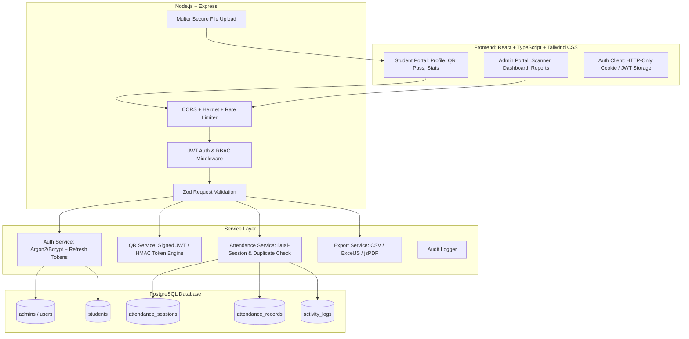
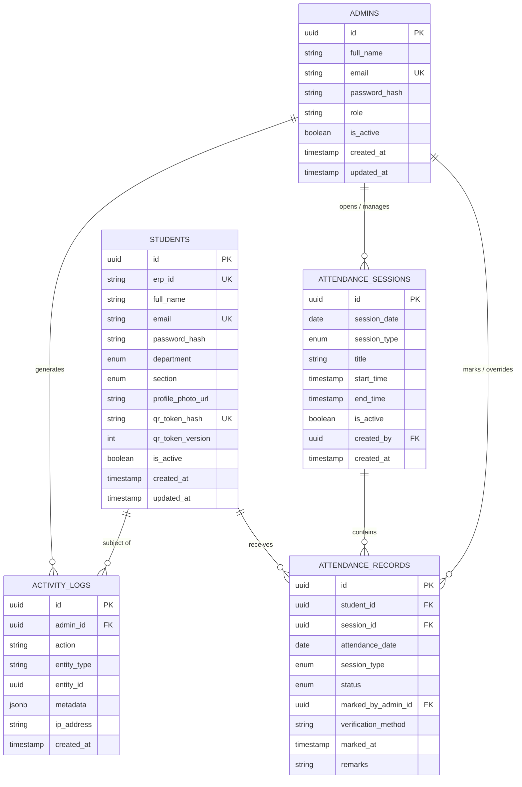
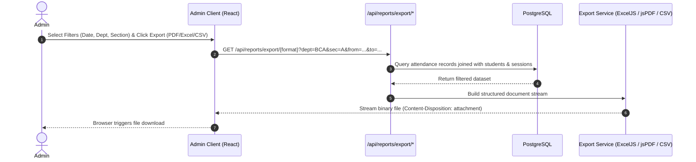

# TECHNO JIGYASA CLUB
## Smart Attendance Management System — Foundation & Architecture Plan

> **Document Version:** 1.0.0  
> **Status:** Architecture & Foundation Blueprint  
> **Target Audience:** Engineering Team, Administrators, Stakeholders  

---

## 1. Executive Summary & Project Context

The **Techno Jigyasa Club Smart Attendance Management System** is a full-stack, enterprise-grade web application designed to eliminate paper-based and manual attendance tracking for club events, workshops, and technical sessions. 

The system enforces strict multi-role separation between:
1. **Students:** Self-registration, personal profile with photo, dynamically rendered & downloadable club-branded digital QR ID card, real-time attendance percentage, and historical attendance tracking.
2. **Admins (3–4 Club Executives):** High-speed camera QR code scanner, duplicate scan prevention, two attendance sessions per day (Session 1 / Morning & Session 2 / Afternoon), comprehensive student directory, manual override controls, low-attendance alerts (< 75%), audit logging, and multi-format reporting (CSV, Excel, PDF).

---

## 2. Workspace & Environment Inspection

- **Workspace Path:** `c:\Users\rs907\OneDrive\Desktop\project`
- **Current State:** Clean directory (no legacy code or conflicting configs).
- **Node.js Runtime:** `v24.20.0`
- **Package Manager:** `npm 11.19.0` (invoked via `npm.cmd` under Windows PowerShell execution policy).
- **Database Engine:** PostgreSQL (can run via local PostgreSQL service, Docker container, or cloud PostgreSQL such as Neon / Supabase).

---

## 3. High-Level Architecture Overview



---

## 4. Complete Project Directory Structure

A clean, decoupled monorepo structure separating client, server, and shared types:

```text
techno-jigyasa-attendance/
│
├── .gitignore
├── README.md
├── DEVELOPMENT_PLAN.md
│
├── server/                               # Backend (Node.js + Express + TypeScript)
│   ├── package.json
│   ├── tsconfig.json
│   ├── .env.example
│   ├── prisma/                           # Database Schema & Migrations
│   │   ├── schema.prisma
│   │   ├── seed.ts                       # Seed initial admins & mock sessions
│   │   └── migrations/
│   ├── src/
│   │   ├── config/                       # Environment, constants, DB connection
│   │   │   ├── env.ts
│   │   │   ├── db.ts
│   │   │   └── constants.ts
│   │   ├── controllers/                  # Route handlers
│   │   │   ├── auth.controller.ts
│   │   │   ├── student.controller.ts
│   │   │   ├── attendance.controller.ts
│   │   │   ├── session.controller.ts
│   │   │   ├── admin.controller.ts
│   │   │   └── report.controller.ts
│   │   ├── middlewares/                  # Auth, RBAC, Validation, Error Handling
│   │   │   ├── auth.middleware.ts
│   │   │   ├── rbac.middleware.ts
│   │   │   ├── validate.middleware.ts
│   │   │   ├── upload.middleware.ts
│   │   │   ├── rateLimiter.middleware.ts
│   │   │   └── errorHandler.middleware.ts
│   │   ├── routes/                       # Express route definitions
│   │   │   ├── auth.routes.ts
│   │   │   ├── student.routes.ts
│   │   │   ├── attendance.routes.ts
│   │   │   ├── session.routes.ts
│   │   │   ├── admin.routes.ts
│   │   │   ├── report.routes.ts
│   │   │   └── index.ts
│   │   ├── services/                     # Business logic
│   │   │   ├── auth.service.ts
│   │   │   ├── qr.service.ts             # Cryptographic QR token generation & verification
│   │   │   ├── attendance.service.ts     # Duplicate prevention & session logic
│   │   │   ├── report.service.ts         # CSV, Excel, PDF exporters
│   │   │   └── audit.service.ts          # Action logging
│   │   ├── types/                        # Backend type definitions
│   │   │   └── express.d.ts
│   │   ├── utils/                        # Helpers (crypto, tokens, response formatter)
│   │   │   ├── token.util.ts
│   │   │   ├── hash.util.ts
│   │   │   └── apiResponse.util.ts
│   │   ├── validators/                   # Zod schemas for request validation
│   │   │   ├── auth.validator.ts
│   │   │   ├── student.validator.ts
│   │   │   └── attendance.validator.ts
│   │   └── app.ts                        # Express server entry point
│   └── uploads/                          # Stored profile photos (git-ignored)
│       └── profiles/
│
├── client/                               # Frontend (React 18 + TypeScript + Vite + Tailwind CSS)
│   ├── package.json
│   ├── tsconfig.json
│   ├── vite.config.ts
│   ├── tailwind.config.js
│   ├── postcss.config.js
│   ├── index.html
│   ├── public/
│   │   ├── logo.svg                      # Techno Jigyasa Club Logo
│   │   └── favicon.ico
│   └── src/
│       ├── assets/                       # Static graphics, badges, sound effects (beep on scan)
│       ├── components/                   # Reusable UI components
│       │   ├── common/
│       │   │   ├── Button.tsx
│       │   │   ├── Input.tsx
│       │   │   ├── Select.tsx
│       │   │   ├── Modal.tsx
│       │   │   ├── Card.tsx
│       │   │   ├── Badge.tsx
│       │   │   ├── Toast.tsx
│       │   │   └── Spinner.tsx
│       │   ├── layout/
│       │   │   ├── Navbar.tsx
│       │   │   ├── Sidebar.tsx
│       │   │   ├── Footer.tsx
│       │   │   └── DashboardLayout.tsx
│       │   ├── student/
│       │   │   ├── QRCard.tsx             # Printable / downloadable digital ID card
│       │   │   ├── AttendanceStats.tsx
│       │   │   ├── AttendanceCalendar.tsx
│       │   │   └── ProfileEditModal.tsx
│       │   └── admin/
│       │       ├── QRCameraScanner.tsx    # html5-qrcode video feed scanner
│       │       ├── ScannedStudentModal.tsx # Instant popup with student info & "Mark Present"
│       │       ├── SessionController.tsx  # Switch between Session 1 & Session 2
│       │       ├── AttendanceTable.tsx
│       │       ├── LowAttendanceAlert.tsx # Warning list for <75%
│       │       ├── AnalyticsCharts.tsx    # Recharts visuals
│       │       └── ExportDropdown.tsx     # CSV, Excel, PDF triggers
│       ├── context/                      # State management (AuthContext, ThemeContext)
│       │   └── AuthContext.tsx
│       ├── hooks/                        # Custom React hooks
│       │   ├── useAuth.ts
│       │   ├── useScanner.ts
│       │   └── useDebounce.ts
│       ├── pages/                        # Page-level views
│       │   ├── auth/
│       │   │   ├── StudentLogin.tsx
│       │   │   ├── StudentRegister.tsx
│       │   │   └── AdminLogin.tsx
│       │   ├── student/
│       │   │   ├── StudentDashboard.tsx
│       │   │   ├── MyQRPass.tsx
│       │   │   ├── MyAttendance.tsx
│       │   │   └── StudentProfile.tsx
│       │   └── admin/
│       │       ├── AdminDashboard.tsx
│       │       ├── LiveScannerPage.tsx
│       │       ├── StudentsDirectoryPage.tsx
│       │       ├── AttendanceManagerPage.tsx
│       │       ├── ReportsPage.tsx
│       │       └── AuditLogsPage.tsx
│       ├── routes/                       # Protected & Public routing
│       │   ├── AppRoutes.tsx
│       │   ├── ProtectedRoute.tsx
│       │   └── AdminRoute.tsx
│       ├── services/                     # Axios API clients
│       │   ├── api.ts
│       │   ├── auth.api.ts
│       │   ├── student.api.ts
│       │   ├── attendance.api.ts
│       │   └── admin.api.ts
│       ├── types/                        # Frontend TypeScript definitions
│       │   └── index.ts
│       ├── utils/                        # Formatting, date helpers, PDF generator
│       │   ├── cardDownloader.ts         # html2canvas / canvas exporter for QR card
│       │   └── formatters.ts
│       ├── App.tsx
│       ├── main.tsx
│       └── index.css                     # Tailwind directives + custom tokens
│
└── shared/                               # Shared contracts and enums (optional/monorepo)
    └── types.ts
```

---

## 5. Database Architecture & Schema Design (PostgreSQL)

### 5.1 Enums & Constraints
- **Department Enum:** `'BCA'`, `'B_TECH_AIML'`, `'B_TECH_CSE'`, `'B_TECH_EN'`, `'MCA'`
- **Section Enum:** `'A'`, `'B'`, `'C'`, `'D'`
- **SessionType Enum:** `'SESSION_1'`, `'SESSION_2'` (representing morning & afternoon club sessions)
- **AttendanceStatus Enum:** `'PRESENT'`, `'ABSENT'`, `'LATE'`, `'EXCUSED'`
- **AdminRole Enum:** `'SUPER_ADMIN'`, `'ADMIN'`

---

### 5.2 Entity Relationship Diagram (ERD)



---

### 5.3 Detailed Table Specifications

#### Table: `admins`
Stores club executive credentials for the 3–4 administrators.
| Column | Type | Constraints | Description |
|---|---|---|---|
| `id` | `UUID` | Primary Key, Default `gen_random_uuid()` | Admin identifier |
| `full_name` | `VARCHAR(100)` | NOT NULL | Admin full name |
| `email` | `VARCHAR(150)` | NOT NULL, UNIQUE, Lowercase index | Login identifier |
| `password_hash` | `VARCHAR(255)` | NOT NULL | Bcrypt hash (cost factor 12) |
| `role` | `admin_role` | NOT NULL, Default `'ADMIN'` | `'SUPER_ADMIN'` or `'ADMIN'` |
| `is_active` | `BOOLEAN` | NOT NULL, Default `TRUE` | Enable/disable admin access |
| `created_at` | `TIMESTAMPTZ` | NOT NULL, Default `NOW()` | Record creation timestamp |
| `updated_at` | `TIMESTAMPTZ` | NOT NULL, Default `NOW()` | Record update timestamp |

#### Table: `students`
Stores registered student profiles.
| Column | Type | Constraints | Description |
|---|---|---|---|
| `id` | `UUID` | Primary Key, Default `gen_random_uuid()` | Unique internal ID |
| `erp_id` | `VARCHAR(50)` | NOT NULL, UNIQUE, Upper index | College ERP ID (e.g. `ERP20240101`) |
| `full_name` | `VARCHAR(150)` | NOT NULL | Student's full name |
| `email` | `VARCHAR(150)` | NOT NULL, UNIQUE, Lower index | Student email address |
| `password_hash` | `VARCHAR(255)` | NOT NULL | Bcrypt hash (cost factor 12) |
| `department` | `department_enum` | NOT NULL | BCA, B.Tech AIML, CSE, E.N, MCA |
| `section` | `section_enum` | NOT NULL | A, B, C, D |
| `profile_photo_url` | `VARCHAR(255)` | NULLABLE | Uploaded photo file path |
| `qr_token_hash` | `VARCHAR(255)` | NOT NULL, UNIQUE | SHA-256 hash of active QR secret |
| `qr_token_version`| `INTEGER` | NOT NULL, Default `1` | Increments upon QR revocation |
| `is_active` | `BOOLEAN` | NOT NULL, Default `TRUE` | Status flag |
| `created_at` | `TIMESTAMPTZ` | NOT NULL, Default `NOW()` | Registration date |
| `updated_at` | `TIMESTAMPTZ` | NOT NULL, Default `NOW()` | Profile update date |

#### Table: `attendance_sessions`
Defines daily attendance periods (Morning / Afternoon).
| Column | Type | Constraints | Description |
|---|---|---|---|
| `id` | `UUID` | Primary Key, Default `gen_random_uuid()` | Session identifier |
| `session_date` | `DATE` | NOT NULL | Target calendar date |
| `session_type` | `session_type_enum`| NOT NULL | `'SESSION_1'` or `'SESSION_2'` |
| `title` | `VARCHAR(100)` | NOT NULL | e.g., "Morning Technical Workshop" |
| `start_time` | `TIMESTAMPTZ` | NOT NULL | Scheduled start |
| `end_time` | `TIMESTAMPTZ` | NOT NULL | Scheduled end |
| `is_active` | `BOOLEAN` | NOT NULL, Default `FALSE` | Indicates currently scanning session |
| `created_by` | `UUID` | Foreign Key (`admins.id`) | Creator admin |
| `created_at` | `TIMESTAMPTZ` | NOT NULL, Default `NOW()` | Record created |

> **Unique Session Constraint:**  
> `UNIQUE(session_date, session_type)` ensures only one Session 1 and one Session 2 can exist per calendar day.

#### Table: `attendance_records`
The core ledger of recorded attendance events.
| Column | Type | Constraints | Description |
|---|---|---|---|
| `id` | `UUID` | Primary Key, Default `gen_random_uuid()` | Record identifier |
| `student_id` | `UUID` | NOT NULL, FK (`students.id`) | Attending student |
| `session_id` | `UUID` | NOT NULL, FK (`attendance_sessions.id`) | Associated session |
| `attendance_date` | `DATE` | NOT NULL | Redundant date column for fast index |
| `session_type` | `session_type_enum`| NOT NULL | Redundant session type for fast index |
| `status` | `attendance_status`| NOT NULL, Default `'PRESENT'` | Status |
| `marked_by_admin_id`| `UUID` | NOT NULL, FK (`admins.id`) | Scanning admin |
| `verification_method`| `VARCHAR(30)` | NOT NULL, Default `'QR_SCAN'` | `'QR_SCAN'` or `'MANUAL_OVERRIDE'` |
| `marked_at` | `TIMESTAMPTZ` | NOT NULL, Default `NOW()` | Exact scan timestamp |
| `remarks` | `VARCHAR(255)` | NULLABLE | Notes for manual overrides |

> **CRITICAL Database-Level Duplicate Prevention:**  
> `CONSTRAINT unique_student_session UNIQUE (student_id, session_id);`  
> In addition: `CONSTRAINT unique_student_day_session UNIQUE (student_id, attendance_date, session_type);`  
> Any concurrent or duplicate scan attempt triggers a PostgreSQL `23505 unique_violation` error, guaranteed by ACID transaction semantics.

#### Table: `activity_logs`
Audit log for security and compliance.
| Column | Type | Constraints | Description |
|---|---|---|---|
| `id` | `UUID` | Primary Key, Default `gen_random_uuid()` | Log ID |
| `admin_id` | `UUID` | FK (`admins.id`), NULLABLE | Actor admin |
| `action` | `VARCHAR(80)` | NOT NULL | E.g., `SCAN_SUCCESS`, `MANUAL_MARK`, `STUDENT_EDIT` |
| `entity_type` | `VARCHAR(50)` | NOT NULL | `ATTENDANCE`, `STUDENT`, `SESSION` |
| `entity_id` | `UUID` | NULLABLE | Target record ID |
| `metadata` | `JSONB` | NULLABLE | Payload snapshot (ERP ID, old/new values) |
| `ip_address` | `VARCHAR(45)` | NULLABLE | Client IP |
| `created_at` | `TIMESTAMPTZ` | NOT NULL, Default `NOW()` | Timestamp |

---

## 6. Backend API Architecture & Route Contracts

All API endpoints follow RESTful conventions, returning a standardized JSON envelope:
```json
{
  "success": true,
  "message": "Operation completed successfully",
  "data": { ... },
  "error": null
}
```

### 6.1 Authentication Endpoints (`/api/auth`)
| Method | Endpoint | Access | Purpose |
|---|---|---|---|
| `POST` | `/api/auth/student/register` | Public | Student signup with ERP ID, details, password |
| `POST` | `/api/auth/student/login` | Public | Student login -> returns JWT & user profile |
| `POST` | `/api/auth/admin/login` | Public | Admin login -> returns Admin JWT |
| `POST` | `/api/auth/logout` | Authenticated | Clears cookies/tokens |
| `GET` | `/api/auth/me` | Authenticated | Returns current authenticated user session |

### 6.2 Student Endpoints (`/api/student`)
| Method | Endpoint | Access | Purpose |
|---|---|---|---|
| `GET` | `/api/student/profile` | Student | Get own profile with full details |
| `PUT` | `/api/student/profile` | Student | Update allowed fields (e.g., photo, phone) |
| `POST` | `/api/student/photo` | Student | Upload profile image (multipart/form-data) |
| `GET` | `/api/student/qr-pass` | Student | Get signed QR token & digital ID card payload |
| `GET` | `/api/student/attendance` | Student | Get personal attendance stats & full history |

### 6.3 Attendance & Scanner Endpoints (`/api/attendance`)
| Method | Endpoint | Access | Purpose |
|---|---|---|---|
| `POST` | `/api/attendance/verify-qr` | Admin | Decodes QR token, validates student, checks duplicate |
| `POST` | `/api/attendance/mark` | Admin | Confirms attendance marking for active session |
| `POST` | `/api/attendance/manual-mark` | Admin | Manual override attendance by ERP ID |
| `GET` | `/api/attendance/today` | Admin | Get today's scans for Session 1 & Session 2 |
| `GET` | `/api/attendance/history` | Admin | Filterable attendance records (date, dept, sec) |

### 6.4 Session Management (`/api/sessions`)
| Method | Endpoint | Access | Purpose |
|---|---|---|---|
| `GET` | `/api/sessions/active` | Public / Auth | Get current active session (Session 1 or 2) |
| `POST` | `/api/sessions/create` | Admin | Create/schedule session for date & slot |
| `PATCH`| `/api/sessions/:id/activate` | Admin | Set active session for live scanning |
| `PATCH`| `/api/sessions/:id/close` | Admin | Close session when attendance period ends |

### 6.5 Admin Management & Analytics (`/api/admin`)
| Method | Endpoint | Access | Purpose |
|---|---|---|---|
| `GET` | `/api/admin/dashboard-stats`| Admin | High-level KPIs (total, present, low attendance) |
| `GET` | `/api/admin/recent-scans` | Admin | Stream/list of recent 20 scans |
| `GET` | `/api/admin/low-attendance` | Admin | Students below 75% attendance threshold |
| `GET` | `/api/admin/students` | Admin | Filtered & paginated student list |
| `GET` | `/api/admin/students/:id` | Admin | Detailed student profile + attendance log |
| `PUT` | `/api/admin/students/:id` | Admin | Edit student record |
| `POST` | `/api/admin/students/:id/regenerate-qr` | Admin | Invalidate old QR and generate new token |
| `GET` | `/api/admin/audit-logs` | Admin | Activity and security audit trail |

### 6.6 Reports & Export (`/api/reports`)
| Method | Endpoint | Access | Purpose |
|---|---|---|---|
| `GET` | `/api/reports/export/csv` | Admin | Stream filtered attendance data as CSV |
| `GET` | `/api/reports/export/excel`| Admin | Generate styled multi-sheet `.xlsx` file |
| `GET` | `/api/reports/export/pdf` | Admin | Generate structured PDF attendance sheet |

---

## 7. Authentication & Authorization Architecture

### 7.1 Security Rules
1. **Password Hashing:** Passwords are never stored in plaintext. Uses `bcrypt` with work factor 12.
2. **Payload Protection:** Passwords and password hashes are strictly omitted from all DTOs and API responses (`delete user.password_hash`).
3. **Session Management:** Stateless JSON Web Tokens (JWT) signed with `HS256` or `RS256`. 
   - **Access Token:** Short-lived (15 minutes).
   - **Refresh Token:** Long-lived (7 days), stored in an `httpOnly`, `SameSite=Strict`, `Secure` cookie.
4. **Role-Based Access Control (RBAC):**
   - Middleware `requireAuth`: Verifies token signature and checks if user is active.
   - Middleware `requireRole(['ADMIN', 'SUPER_ADMIN'])`: Restricts admin endpoints.
   - Middleware `requireStudent`: Restricts student endpoints.
5. **No Frontend Hardcoding:** No mock or dummy admin logins; admins are initialized via database seed scripts with secure environment variables.

---

## 8. QR Code Architecture (Security & Anti-Spoofing)

### 8.1 The Security Vulnerability of Plain QR Codes
If a QR code contains just an ERP ID (e.g., `ERP20240101`), any student could easily generate a fake QR code for a friend and mark proxy attendance.

### 8.2 Cryptographic QR Token Solution
1. **Token Composition:**
   The QR code contains a **cryptographically signed, tamper-evident payload**:
   ```json
   {
     "sub": "student-uuid",
     "erp": "ERP20240101",
     "v": 1,
     "iat": 1728312000,
     "sig": "HMAC_SHA256(student_id + erp_id + token_version, QR_SECRET)"
   }
   ```
   Or a signed compact JWT with `QR_SECRET`.
2. **Revocation & Invalidation:**
   Each student record has a `qr_token_version` column. If a student's card is lost, leaked, or shared, the student or admin can click **"Regenerate QR Code"**. This increments `qr_token_version` in the database, immediately invalidating any printed or screenshot version of the previous code.
3. **Scan Flow:**
   - Admin scans the QR with the device camera.
   - The scanner extracts the signed string and transmits it via `POST /api/attendance/verify-qr`.
   - Backend validates signature using `QR_SECRET`.
   - Backend checks `qr_token_version` against DB.
   - Backend checks whether student already has attendance recorded for the active session.
   - Response returns student details and verification status.

---

## 9. Attendance Session Architecture (Two Sessions Per Day)

To support college club schedules with morning and afternoon activities, attendance is divided into **two distinct sessions per day**:

| Session Name | Identifier | Typical Hours | Description |
|---|---|---|---|
| **Session 1 (Morning)** | `SESSION_1` | 09:30 AM – 01:00 PM | Morning technical lecture / lab |
| **Session 2 (Afternoon)**| `SESSION_2` | 01:30 PM – 05:00 PM | Afternoon project work / coding |

### 9.1 Session Rules
1. **One Active Session at a Time:** An admin explicitly selects which session is currently active for scanning.
2. **Independent Duplicate Checks:** A student marked present in Session 1 can (and should) be marked present in Session 2. However, a student **cannot be marked twice in the same session**.
3. **Session Lifecycle:**
   - `SCHEDULED` -> `ACTIVE` (scanning allowed) -> `CLOSED` (scanning locked, reports finalized).

---

## 10. Student Portal Structure & UI/UX Design

The Student Portal is mobile-first, responsive, and styled with Techno Jigyasa Club branding (deep indigo, electric cyan accents, dark/light theme support):

1. **Registration & Onboarding:**
   - Clean card-based form with validations (ERP ID format, department select, section select, password match).
   - Profile photo upload with live circular preview.
2. **Personal Dashboard:**
   - **Header Card:** Student photo, full name, ERP ID badge, Department & Section tags.
   - **Attendance Progress Gauge:** Circular / linear progress bar showing overall %:
     - Green (`>= 75%`), Amber (`60% - 74%`), Red (`< 60%`).
   - **Quick Counters:** Total Sessions Held, Attended Count, Absent Count.
3. **Digital QR Pass / ID Card:**
   - High-fidelity club member card layout.
   - Embedded QR code generated via `qrcode.react`.
   - Student avatar, name, ERP ID, department, section, club emblem.
   - **Download Card Button:** Renders the card to high-resolution PNG or PDF using HTML5 canvas / jsPDF for offline scanning.
4. **Attendance History:**
   - Tabular and calendar views.
   - Columns: Date, Session (Morning/Afternoon), Status Badge, Marked Time.
5. **Profile Settings:**
   - Update photo, change password (requiring current password).

---

## 11. Admin Portal Structure & UI/UX Design

Built for speed, high scan volume, and administrative clarity:

1. **Dashboard Overview:**
   - **Top KPI Cards:**
     - Registered Students Count
     - Today's Session 1 Attendance (Count + %)
     - Today's Session 2 Attendance (Count + %)
     - Low Attendance Alert Count (< 75%)
   - **Active Session Switcher:** Toggle or select Session 1 vs Session 2.
   - **Live Scanner Feed:** Interactive camera preview box with auto-focus.
   - **Scanned Student Confirmation Modal:**
     - Student photo, ERP ID, Name, Department, Section.
     - Status Indicator: "Not Marked Yet" (Green) vs "Already Marked!" (Red Warning with audio buzz).
     - "Mark Present" one-click button (with option for auto-mark mode).
   - **Live Scans Feed:** Real-time list of the last 15 scans with timestamp and status.
2. **Student Management Directory:**
   - Data grid with search (by ERP ID, name) and multi-filter (Department: BCA, B.Tech AIML, B.Tech CSE, B.Tech E.N, MCA; Section: A, B, C, D).
   - Action buttons: View Profile, Edit Details, Reset QR Code, View Individual Log.
3. **Attendance Management & Manual Override:**
   - Search student by ERP ID and manually mark Present / Late / Excused with mandatory remark field for audit.
4. **Reports & Exports Hub:**
   - Filter by Date Range, Session, Department, and Section.
   - One-click exports:
     - **CSV Export:** Fast raw data dump.
     - **Excel Export:** Formatted spreadsheet with summary headers and attendance percentages.
     - **PDF Export:** Printable official club attendance report with signature lines.
5. **Audit Logs View:**
   - Searchable chronological list of all admin actions (who marked whom, when, and how).

---

## 12. Report & Export Architecture



- **CSV:** Built using streaming Node.js `fast-csv` or native string builders for low memory overhead.
- **Excel:** Built with `exceljs`, featuring styled header rows, column widths, conditional formatting (color green for present, red for absent).
- **PDF:** Generated with `pdfmake` or `jspdf` + `jspdf-autotable`, including Techno Jigyasa Club header, timestamp, filter parameters, and page numbers.

---

## 13. Comprehensive Security Specifications

1. **Authentication Protection:**
   - Strong password requirements (minimum 8 characters, numbers, letters).
   - Rate limiting on `/api/auth/*` endpoints (max 5 failed attempts per 15 minutes per IP).
2. **Input Sanitization & Validation:**
   - Strict `zod` schemas for every incoming HTTP request payload.
   - Protection against SQL injection via parameterized queries / ORM.
   - Protection against XSS through sanitization and React's built-in JSX escaping.
3. **Database Constraints:**
   - Unique constraints prevent race condition duplicates.
   - Foreign key cascading rules protect referential integrity.
4. **File Upload Security:**
   - Allowed MIME types: `image/jpeg`, `image/png`, `image/webp`.
   - Max file size limit: 2MB.
   - Randomized filenames (`crypto.randomUUID()`) to prevent directory traversal attacks.
5. **CORS & Headers:**
   - Strict CORS configuration allowing only the designated frontend URL.
   - `helmet` middleware configuring `Content-Security-Policy`, `X-Frame-Options`, `X-Content-Type-Options`.

---

## 14. Phased Implementation Roadmap

```text
Phase 1: Foundation & Project Setup
  ├── Initialize Monorepo / Folders (server & client)
  ├── Setup TypeScript, Tailwind CSS, Vite, Express
  └── Setup PostgreSQL database connection and Prisma schema

Phase 2: Database Schema & Authentication
  ├── Run migrations for all tables (admins, students, sessions, records, logs)
  ├── Seed initial administrators (with secure bcrypt hashes)
  ├── Implement Student Registration & Login (JWT + Cookies)
  └── Implement Admin Login & RBAC middlewares

Phase 3: Student Portal & QR Code Generation
  ├── Build Student Profile & Photo Upload
  ├── Implement Cryptographic QR Token Generator
  ├── Build Downloadable Techno Jigyasa Digital Club Card (Canvas/PNG/PDF)
  └── Build Student Attendance Stats & History View

Phase 4: Attendance Sessions & QR Scanner Engine
  ├── Implement Dual Session Management (Morning / Afternoon)
  ├── Integrate html5-qrcode camera scanner in Admin Portal
  ├── Implement instant scan modal with student info display
  └── Implement duplicate prevention & audio/visual feedback

Phase 5: Admin Management, Analytics & Reports
  ├── Student Directory with Department/Section filters & search
  ├── Admin Analytics Dashboard (Recharts KPIs, low attendance detection)
  ├── Manual attendance override system
  └── Multi-format exports (CSV, Excel, PDF)

Phase 6: Verification, Polishing & End-to-End Testing
  ├── Cross-browser camera testing & mobile responsiveness
  ├── Security audit & error handling verification
  └── Complete documentation & deployment guide
```

---

## 15. Next Immediate Action
Awaiting user confirmation of this architecture foundation before creating project scaffolding and executing Phase 1.
